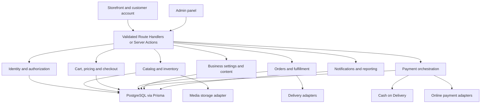

# Marketplace Architecture

## Status

এই document target architecture-এর planning baseline। এখানে বর্ণিত module বা schema এখনো implement হয়েছে ধরে নেওয়া যাবে না। Current implementation-এর সত্যতা `CURRENT_PROJECT_ANALYSIS.md`-এ নথিভুক্ত।

## Target system shape

Target হবে per-business deployable modular monolith। একই Next.js application storefront, customer account এবং admin surface serve করবে; business rules domain modules-এ থাকবে; PostgreSQL authoritative store হবে।



## Core decisions

### Single-business core

প্রতিটি deployment একটি business-এর জন্য। Reusability configuration এবং adapters থেকে আসবে, runtime multi-tenancy থেকে নয়। ভবিষ্যতে SaaS control plane দরকার হলে সেটি আলাদা architecture decision হবে।

### Multi-vendor is optional

Core catalog business-owned। `admin` বা `catalog_manager` product manage করবে। External seller onboarding, KYC, commission, payout, disputes এবং seller settlement core backlog-এর অংশ নয়। এগুলো future seller bounded context।

### Modular monolith before microservices

Authentication, catalog, checkout, order এবং payment আলাদা logical modules হবে, কিন্তু initial deployment একটি application এবং database। Transactional correctness ও operational simplicity microservice decomposition-এর চেয়ে গুরুত্বপূর্ণ।

### Preserve visual design

Existing MUI theme, layout এবং component composition design baseline। Implementation task behavior এবং data wiring বদলাবে; redesign আলাদা explicit project ছাড়া করা হবে না।

## Proposed modules

| Module | Responsibility |
|---|---|
| Identity | Registration, login, verification, password recovery, account state |
| Authorization | Role এবং resource-level policies |
| Customer | Profile, addresses, preferences |
| Catalog | Product, variants, media, category, public queries |
| Inventory | Balances, reservations, commits, releases, adjustments |
| Wishlist | Customer-product saved relationship |
| Cart | Guest/customer cart lifecycle |
| Pricing | Currency-safe subtotal, discount, coupon, tax, shipping total |
| Checkout | Address, delivery quote, payment eligibility, finalization |
| Payment | Payment attempts, adapters, webhooks, COD collection, refunds |
| Order | Immutable order snapshots, statuses, history, cancellation, return |
| Fulfillment | Shipment, carrier, tracking, delivery status |
| Settings | Business, branding, payment, delivery এবং operational rules |
| Content | Homepage sections এবং localized content |
| Notification | Outbox, email, in-app events, customer preferences |
| Reporting | Operational KPIs এবং exports |
| Audit | Sensitive changes-এর actor এবং metadata |

## Layering rules

প্রতিটি domain module-এর recommended internal layers:

```text
UI page/widget/form
    -> Route Handler or Server Action
        -> validation and authorization
            -> domain/application service
                -> repository/Prisma transaction
                    -> database or external adapter
```

- UI কখনো authoritative total বা permission সিদ্ধান্ত নেবে না।
- Route Handler/Server Action complex Prisma mutation সরাসরি করবে না।
- Domain service Next.js response object জানবে না।
- External provider response canonical domain types-এ normalize হবে।
- Read model প্রয়োজনমতো optimized হতে পারে, কিন্তু mutation domain invariant bypass করবে না।

## Data rules

### Money

- Money `Float` হবে না।
- Prisma `Decimal` অথবা integer minor units ব্যবহার হবে।
- প্রতিটি monetary aggregate-এর সঙ্গে ISO currency থাকবে।
- Order totals immutable snapshot হবে।
- Client-submitted price কখনো authoritative নয়।

### Status separation

Order, payment এবং fulfillment status আলাদা থাকবে। একটি order delivered হলেও COD payment collection pending থাকতে পারে; system এটি anomaly হিসেবে report করবে, একই status field দিয়ে ঢেকে দেবে না।

### Historical retention

- Product update পুরোনো order item বদলাবে না।
- Customer/product hard delete financial history cascade করবে না।
- Archive বা anonymization policy ব্যবহার হবে।
- Payment events, status history এবং audit records append-oriented হবে।

### Transaction boundaries

Checkout finalization transaction অন্তত নিচের operations coordinate করবে:

1. Idempotency key claim।
2. Cart এবং checkout version revalidation।
3. Product price/visibility/stock revalidation।
4. Coupon eligibility revalidation।
5. Inventory reserve/commit।
6. Order এবং item snapshots create।
7. Payment attempt বা COD pending-collection record create।
8. Reliable outbox event persist।

Failure হলে partial order বা silent stock loss থাকা যাবে না।

## Security architecture

- Deny-by-default authorization policy।
- Session-এ typed user ID, role এবং account status।
- Admin layout protection যথেষ্ট নয়; প্রতিটি mutation server-side policy enforce করবে।
- Webhook signature verification এবং event idempotency বাধ্যতামূলক।
- Secrets environment-এ থাকবে; admin UI secret value ফেরত দেবে না।
- Customer শুধু নিজের profile, address, cart, wishlist, order এবং notification access করবে।
- Sensitive admin action audit হবে।
- Distributed deployment-এর rate limiting shared store-backed হবে।

## Configuration architecture

| Layer | Examples | Storage |
|---|---|---|
| Secrets | Payment secret, SMTP password, storage secret | Environment/secret manager |
| Business identity | Name, legal name, contact, address | Database settings |
| Commerce policy | Currency, tax, order rules | Database settings |
| Payment rules | Enabled methods, COD constraints | Database settings |
| Delivery rules | Zones, rates, free shipping | Database tables/settings |
| Branding | Logo, colors, favicon, SEO defaults | Database plus media storage |
| Content | Homepage sections, localized text | Database content models |
| Feature flags | Optional modules | Validated configuration |

## External adapters

Payment, storage, email এবং shipping provider-এর জন্য interface/adapter ব্যবহার হবে। Provider-specific identifiers persistence-এ রাখা যাবে, কিন্তু provider response সরাসরি storefront বা core order logic-এ leak করবে না।

## Caching and events

- Product/catalog read caching explicit invalidation policyসহ হবে।
- Business settings bounded cache ব্যবহার করতে পারে।
- Cart, checkout, payment এবং inventory mutation cached response-এর উপর নির্ভর করবে না।
- Reliable outbox order/payment/fulfillment transaction-এর সঙ্গে event persist করবে।
- Notification এবং analytics consumer idempotent হবে।

## Future extension boundaries

- Multi-vendor seller, commission, payout।
- Multiple warehouses।
- Multi-currency catalog pricing।
- Subscription products।
- Advanced tax provider।
- Search engine adapter।
- Native mobile client/API separation।

এই extension-গুলোর জন্য current core-এ অপ্রয়োজনীয় tables বা abstractions আগে থেকে যোগ করা হবে না; তবে order snapshots, adapters এবং module boundaries extension বন্ধ করবে না।

---

## ADR-001: Single-business modular monolith

### Status

Accepted and approved (2026-07-05). Evidence commit: `df3a95d`.

### Context

বর্তমান codebase একটি property/rental listing marketplace starter। লক্ষ্য হলো একে configurable single-business B2C marketplace-এ রূপান্তর করা। নিম্নলিখিত architectural decisions নেওয়া প্রয়োজন:

1. Deployment model: per-business deployable vs multi-tenant SaaS
2. Seller model: single-business vs multi-vendor marketplace
3. Service decomposition: monolith vs microservices
4. Design preservation: rewrite vs incremental change
5. Messaging/support: keep, remove, or redesign the existing peer-chat model

### Decision

| # | Decision | Rationale |
|---|----------|-----------|
| 1 | **Per-business deployable modular monolith** — প্রতিটি deployment একটি business-এর জন্য; reusability configuration/adapter থেকে আসে | Multi-tenant SaaS-এর control plane, tenant isolation এবং billing overhead core scope-এর বাইরে; পরে পৃথক bounded context হিসেবে যোগ করা যাবে |
| 2 | **Single-business core** — catalog business-owned; `admin` এবং `catalog_manager` roles product manage করে | Multi-vendor-এর seller KYC, commission, payout, disputes scope-এর বাইরে; future bounded context |
| 3 | **Modular monolith first** — Authentication, catalog, checkout, order, payment আলাদা logical modules; single application + database deployment | Transactional correctness ও operational simplicity microservice decomposition-এর চেয়ে গুরুত্বপূর্ণ; পরে module isolation প্রয়োজনে separable |
| 4 | **Preserve existing visual design** — MUI theme, layout, component composition baseline হিসেবে; implementation শুধু data wiring এবং behavior বদলায় | Redesign explicit project approval ছাড়া হবে না; baseline screenshot comparison দ্বারা রক্ষিত |
| 5 | **Replace peer messaging with support/contact flow** — বর্তমান `Message` model দুই customer-এর মধ্যে direct chat অনুমতি দেয়, যা B2C scenario-এ customer expectation নয় | Support ticket/contact form দিয়ে replace করলে customer expectation clearer হয় এবং moderation simpler হয় |

### Alternatives considered

| Alternative | Pros | Cons | Why rejected |
|-------------|------|------|--------------|
| Multi-tenant SaaS | Single deployment serves all businesses | Tenant isolation, billing, feature gating complexity | Core scope-এর বাইরে; future extension |
| Multi-vendor marketplace | Multiple sellers per platform | KYC, commission, payout, disputes, seller dashboard | Core scope-এর বাইরে; future bounded context |
| Microservices | Independent deployability, team scaling | Transactional complexity, network overhead, operational cost | 1–2 developer team-এর জন্য premature; modular monolith later separable |
| Full redesign | Clean slate, no legacy | Timeline, existing design system loss, i18n/auth rewrite | Existing MUI design এবং i18n ভালো working state-এ; rewrite justified নয় |
| Keep peer messaging | Existing code reuse | Customer confusion, moderation complexity, no clear B2C use case | Mock implementation incomplete; replaces with simpler support flow |

### Consequences

Positive:
- One application to deploy, test, and monitor
- Transactional integrity across domains (cart → stock → payment → order)
- Existing design, i18n, auth preserved and reused
- Clear module boundaries for future extraction

Negative:
- Single deployment = single point of failure (mitigated by standard HA practices)
- Module boundary enforcement is manual (lint rules, import conventions)
- All domains scale together (no independent scaling)

### Migration posture

- New Product model parallel to Listing; Listing remains read-only during transition
- Feature flags control old vs new code paths
- Migration tasks: P1-08 (data migration strategy), P3-17 (seed and legacy backfill)

### Unresolved decisions

1. **Notification provider abstraction timing** — Phase 2-তে interface define হবে, implementation Phase 8-তে।
2. **Tax calculation** — Manual tax class বনাম third-party provider decision Phase 3/4-এ হবে।
3. **Search engine**: PostgreSQL full-text vs dedicated search provider — Phase 3 performance test-এর পরে সিদ্ধান্ত।

### Decision metadata

| Field | Value |
|-------|-------|
| ADR ID | ADR-001 |
| Title | Single-business modular monolith architecture |
| Date | 2026-07-05 |
| Owner | Architecture owner |
| Status | Accepted and approved |
| Approved by | Ariful Islam (product directive); Codex architecture review |
| Evidence commit | `df3a95d` |
