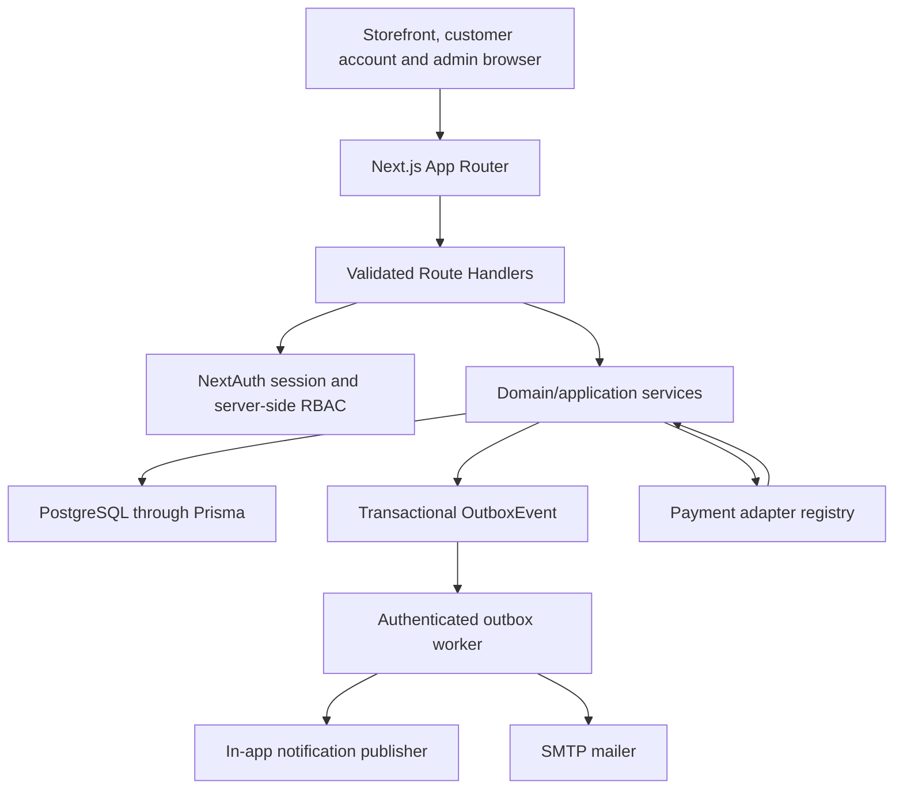
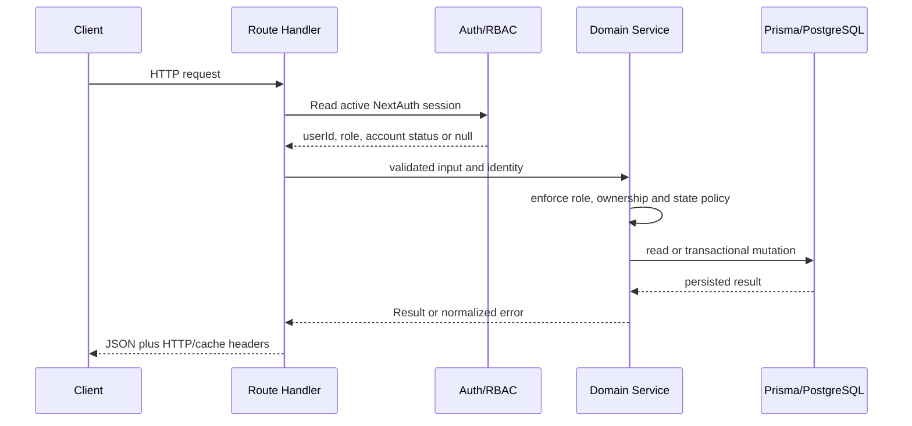
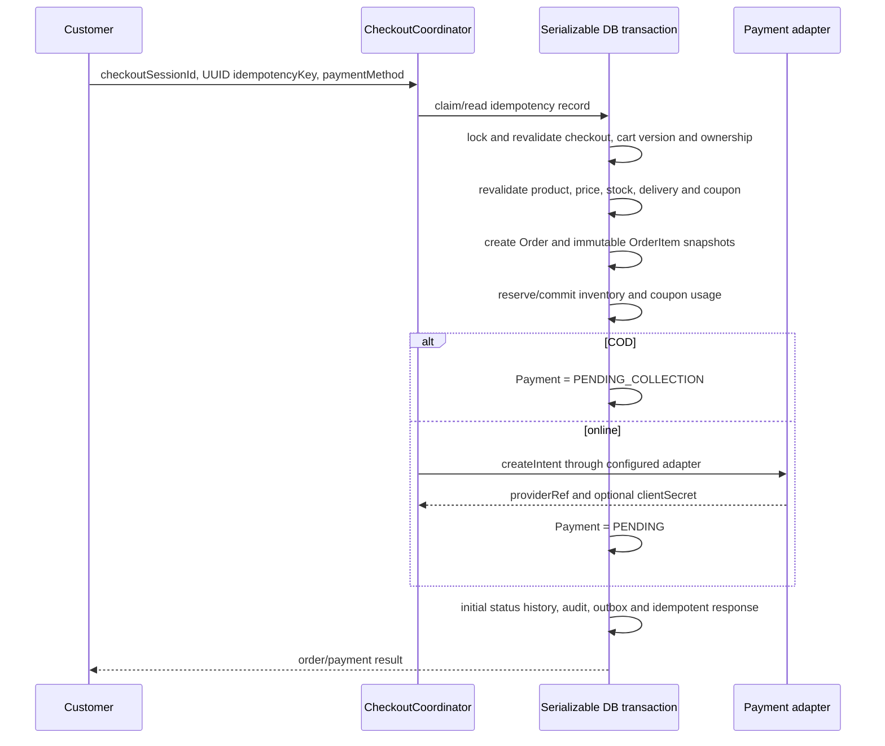
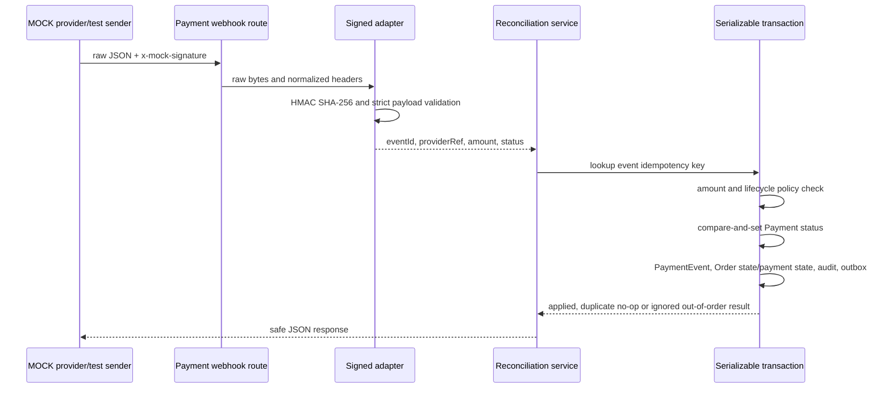
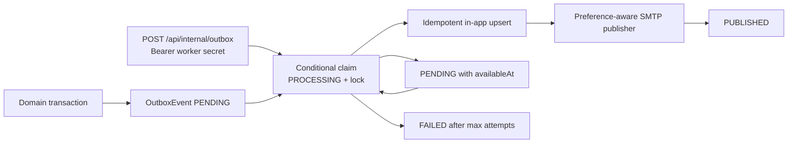

# Marketplace Architecture

## Document status

এই document 2026-07-25 তারিখে বর্তমান source tree, Prisma schema,
migrations এবং route handlers-এর implementation audit থেকে তৈরি। এটি আর
শুধু target plan নয়; এখানে তিন ধরনের statement আলাদা করা হয়েছে:

- **Implemented fact** — repository source বা migration-এ উপস্থিত।
- **Deployment-dependent** — code path আছে, কিন্তু environment/provider/scheduler
  configure এবং live verification প্রয়োজন।
- **Known gap** — repository-তে automation, proof বা production adapter নেই।

Canonical evidence:

- `src/app/api/**/route.ts`
- `src/lib/services/**`
- `src/modules/**`
- `prisma/schema.prisma`
- `prisma/migrations/**`

## System shape

Marketplace একটি reusable, single-business **modular monolith**। একটি Next.js
application storefront, customer account, admin/operations UI এবং JSON APIs
serve করে। PostgreSQL authoritative store এবং Prisma persistence boundary।
এটি runtime multi-tenant SaaS বা multi-vendor settlement platform নয়।



## Runtime and deployment boundary

| Concern        | Implemented fact                                           | Deployment-dependent or gap                                                 |
| -------------- | ---------------------------------------------------------- | --------------------------------------------------------------------------- |
| Web runtime    | Next.js 15 App Router, React 18, Node engine `22.x`        | Hosting topology and production URL are not verified here                   |
| Database       | PostgreSQL datasource, Prisma 5.6, additive SQL migrations | Production database, pooling, HA and replica configuration are not verified |
| Authentication | NextAuth credential provider with JWT session              | External identity providers are not implemented                             |
| UI             | MUI-based storefront/admin implementation                  | MUI is not an architectural requirement                                     |
| Payment        | COD plus signed `MOCK` adapter contract                    | No production online payment provider is implemented or verified            |
| Notification   | In-app publisher and SMTP adapter                          | Scheduler invocation and live SMTP acceptance are not verified              |
| Storage        | Product media stores validated URL metadata                | Upload/object-storage adapter is not part of the audited API                |
| Search         | PostgreSQL/Prisma catalog queries and suggestions          | Dedicated search engine is not implemented                                  |

## Module boundaries

| Module              | Primary implementation                                                                                              | Responsibility                                                                          |
| ------------------- | ------------------------------------------------------------------------------------------------------------------- | --------------------------------------------------------------------------------------- |
| Identity/account    | `src/lib/auth.ts`, `authz.ts`, `services/account.ts`                                                                | Registration, credential authentication, verification, recovery, session invalidation   |
| Customer            | `services/user.ts`, `address.ts`, `wishlist.ts`, `notification.ts`                                                  | Profile, owned addresses, wishlist, notifications/preferences                           |
| Catalog             | `services/product.ts`, `category.ts`, `catalog.ts`                                                                  | Products, variants, media metadata, categories and public catalog reads                 |
| Inventory           | `services/inventory.ts`                                                                                             | Balance, reservation, commit, release, adjustment and append-oriented ledger            |
| Cart/pricing        | `services/cart.ts`, `pricing.ts`, `money.ts`                                                                        | Signed guest identity, customer merge, server-authoritative totals                      |
| Checkout            | `services/checkout.ts`, `cod-eligibility.ts`                                                                        | Checkout snapshot, address/delivery/coupon revalidation, payment eligibility, placement |
| Payment             | `payment-adapter.ts`, `payment-lifecycle.ts`, `payment-reconciliation.ts`, `payment-refund.ts`, `cod-collection.ts` | Provider boundary, webhook reconciliation, COD collection, refunds                      |
| Order               | `services/order-query.ts`, `order-transition.ts`, `order-cancellation.ts`                                           | Owned/staff reads, versioned status transitions and cancellation                        |
| Fulfillment         | `shipment.ts`, `order-return.ts`, `order-compensation.ts`                                                           | Shipment allocation/status, returns and idempotent resource compensation                |
| Administration      | `customer-admin.ts`, `admin-dashboard.ts`, `admin-reporting.ts`                                                     | Customer operations, KPIs, audit and exports                                            |
| Settings/content    | `business-settings.ts`, `content-section.ts`                                                                        | Business/branding/payment/COD settings and revisioned homepage sections                 |
| Reviews/support     | `product-review.ts`, `support-request.ts`                                                                           | Verified-purchase reviews, moderation and customer support workflow                     |
| Notification/outbox | `outbox.ts`, publishers and mailers                                                                                 | Durable event claim/retry, in-app projection and transactional email                    |
| Audit               | `audit.ts` plus transactional `AuditLog` writes                                                                     | Actor/target metadata for sensitive mutations                                           |

### Dependency direction

```text
Page/form
  -> Route Handler
    -> authentication + validation
      -> application/domain service
        -> Prisma transaction and/or adapter
          -> PostgreSQL / provider
```

Rules reflected by the implementation:

1. Client totals, role claims and entity ownership are not authoritative.
2. Domain services return `Result<T>` or throw normalized application errors;
   route handlers translate them to HTTP.
3. Multi-record commerce mutations use Prisma transactions.
4. External provider code is behind adapters.
5. Durable downstream work is written as `OutboxEvent` inside the originating
   transaction where the service uses the outbox contract.

Some older CRUD routes still parse JSON directly or use less uniform error
handling. Those exceptions are recorded under **Known implementation gaps**.

## Request, authentication and authorization flow



Implemented roles:

- `user` — own profile/address/cart/checkout/order/review/wishlist/notification.
- `admin` — full business administration and sensitive settings.
- `support` — operational order, shipment, return, review, customer read and
  support-request access; cannot change business/payment settings except
  explicitly permitted COD reads/previews.
- `catalog_manager` — product, category, media and inventory management.

Authentication uses active account status and `sessionVersion`. Suspending a
customer increments the version so existing JWT sessions become invalid on the
next server validation. UI route protection is supplementary; API services
enforce RBAC/ownership again.

## Core transaction flows

### Checkout and order placement



Placement checks `IdempotencyKey` before and inside the transaction and stores
the response for replay. `Order.idempotencyKey` is also unique. Order items keep
SKU, product name, unit price, quantity and total snapshots; later catalog edits
do not change those values.

### Order, fulfillment and cancellation

- Order and fulfillment status are separate and versioned by
  `Order.statusVersion`.
- Each accepted transition appends `OrderStatusHistory`.
- Cancellation uses a policy (`order_policy` setting), actor role, ownership,
  fulfillment state and customer time window.
- Cancellation updates unpaid payment attempts, compensates inventory/coupon
  resources idempotently, audits the decision and creates outbox events.
- Paid/collected cancellation does not silently refund; it marks
  `refundRequired` and emits a refund-requested event for explicit operator
  handling.

### Payment webhook reconciliation



The route caps raw payloads at 64 KiB. `MOCK_PAYMENT_WEBHOOK_SECRET` must be at
least 32 characters. Duplicate event IDs are idempotent; terminal and
out-of-order transitions do not regress a payment.

### COD collection and refunds

- COD eligibility is evaluated separately from order state and considers global
  enablement, amount, zones, blocked products/categories, item quantity and
  optional verified-phone policy.
- COD orders start with payment `PENDING_COLLECTION`; staff collection uses a
  required `Idempotency-Key` and records `COLLECTED` independently of order and
  fulfillment status.
- Refunds accept positive two-decimal amounts, reserve cumulative
  `Payment.refundedAmount` with compare-and-set semantics, prevent concurrent
  over-refund, append `PaymentEvent`, update order payment status, audit and
  enqueue an outbox event.
- COD refunds are manual references; non-COD refunds call the registered
  adapter. In this repository that online adapter is only `MOCK`.

## Outbox and notification flow



Implemented worker behavior:

- `OUTBOX_WORKER_SECRET` is required and compared through SHA-256 digests with
  `timingSafeEqual`.
- Batch size is bounded to 1–100.
- Claims use conditional updates and can reclaim stale `PROCESSING` locks.
- Attempts increment on claim; failures expose only
  `Publisher delivery failed`.
- In-app notification is first and idempotent through unique
  `Notification.sourceEventId`; SMTP runs last.
- Commerce email supports order, payment and shipment event families and uses a
  deterministic message ID.

Deployment-dependent: no cron/scheduler definition in this repository invokes
the worker. Without an external authenticated trigger, events remain pending.

## Email flows

Two implemented flows intentionally differ:

1. **Account verification/recovery:** request route prepares a one-time token
   and calls `AccountNotificationService` directly. In non-production without
   SMTP it returns a preview URL; in production missing SMTP is treated as
   unavailable. Request endpoints keep enumeration-safe accepted responses.
2. **Commerce notification:** order/payment/shipment events go through the
   transactional outbox, user preferences, template builder and SMTP mailer.
   Missing SMTP is network-silent; configured SMTP rejection makes the worker
   retry.

No live SMTP server or delivery receipt was verified by this documentation
audit.

## Data and consistency rules

- Monetary commerce fields use Prisma `Decimal`; `Money` performs
  currency-aware arithmetic.
- `OrderStatus`, `PaymentStatus` and `FulfillmentStatus` are independent.
- Inventory requires `0 <= reserved <= onHand`.
- Guest cart identity is a signed HttpOnly cookie; a cart has exactly one of
  `userId` or `sessionToken`.
- Order, payment, resource-release, outbox, notification and support updates
  use unique keys/versioning to make retries safe.
- Audit/outbox payloads should contain operational identifiers, not secrets.
- Support public responses return only acceptance/reference/status metadata;
  customer PII is staff-gated.

## Configuration and customization

| Layer             | Storage                                  | Examples                                                               |
| ----------------- | ---------------------------------------- | ---------------------------------------------------------------------- |
| Secrets           | Environment/secret manager               | NextAuth, DB URLs, SMTP password, webhook secret, outbox worker secret |
| Business identity | `BusinessSettings` key `business`        | Name, legal name, support contact, currency, locale, timezone          |
| Branding          | `BusinessSettings` key `branding`        | Logo/favicon URLs, colors, SEO, social links                           |
| Payment methods   | `BusinessSettings` key `payment_methods` | COD/online enabled state, label, description, online provider key      |
| COD rules         | `BusinessSettings` key `cod_rules`       | Amount, zone/product/category/item/phone rules                         |
| Delivery          | `DeliveryZone`, `DeliveryMethod`         | Geography, price, free-shipping and weight windows                     |
| Homepage content  | `ContentSection` revisions               | Lower-page announcement/collection/rich-text/banner/trust sections     |

Homepage Hero and Search composition remain protected. `ContentSectionService`
rejects `hero`, `search`, `search-banner`, `hero-search` and matching prefixed
keys. Other surfaces and design-system choices may evolve per business.

## Legacy retirement boundary

The property/rental `Listing`, listing `Review`, `Message` and `Bookmark`
storage remains for compatibility/migration history, but peer messaging is not
a supported B2C workflow. Support uses `SupportRequest`.

Explicit HTTP retirement contracts:

- `GET|POST /api/listings` → `410`, successor `/api/catalog`.
- `GET|POST /api/reviews` → `410`, successor
  `/api/products/{productId}/reviews`.
- `POST /api/orders` → `410`, successor `/api/checkout/place`.

The replacement header includes `Deprecation: true`, `Cache-Control: no-store`
and a successor `Link`.

## Security boundaries

- Secrets are environment-only and are not accepted in settings JSON.
- Credential passwords are bcrypt hashed; reset/verification tokens are
  one-time, 64-hex values with expiry.
- Webhook and worker endpoints use independent non-session authentication.
- Staff PII responses use private/no-store where the newer routes implement
  that contract.
- Catalog, suggestions, reviews, coupon, delivery, registration, verification,
  recovery and support intake have bounded in-memory rate limits.
- Current rate limiting is process-local; distributed deployments require a
  shared store or edge/provider enforcement.
- Admin/support/catalog-manager permissions are checked in services, not only
  navigation middleware.

## Known implementation gaps and risks

1. Only `MOCK` online payment is registered; production gateway behavior is
   unverified.
2. The repository has no deployed scheduler definition for the outbox worker.
3. SMTP configuration and live delivery are unverified.
4. Rate limits are in-memory and therefore neither shared nor durable across
   instances.
5. API error envelopes are not fully uniform. Notably the checkout
   payment-method route has a raw `error.message` fallback, while some older
   routes parse malformed JSON outside normalized error handling.
6. No automated retention/pruning job exists for tokens, checkout sessions,
   notifications, audit logs, outbox rows or legacy records.
7. No backup/restore automation or production-like restore rehearsal is present.
8. Several foreign keys cascade from `User`/`Order` into financial history.
   Operational policy must prohibit hard deletion until a separate archival and
   anonymization migration is approved.
9. The catalog stores media URLs but no audited upload/object-storage endpoint
   exists.

## ADR-001: Single-business modular monolith

### Status and history

Accepted and approved on 2026-07-05. Original evidence commit recorded in the
planning document: `df3a95d`. This section preserves the architecture governance
decision while the preceding sections describe the implemented state as of
2026-07-25.

### Decision

| Decision          | Accepted position                                                                               |
| ----------------- | ----------------------------------------------------------------------------------------------- |
| Deployment model  | Per-business deployable; reusability comes from configuration and adapters, not runtime tenants |
| Seller model      | Business-owned catalog; multi-vendor KYC, commission, payout and settlement are outside core    |
| Service shape     | Modular monolith before microservices                                                           |
| Design scope      | Preserve homepage/Hero/Search identity; other screens and design systems remain flexible        |
| Messaging/support | Retire peer chat and use a B2C support/contact workflow                                         |

### Consequences

Positive:

- One application and authoritative database simplify commerce transactions.
- Module boundaries can later be extracted without paying premature
  distributed-system cost.
- A business can customize brand, catalog, delivery, payment rules and content.

Trade-offs:

- Modules scale and deploy together.
- Boundary enforcement depends on code review and tests.
- A single deployment is one failure domain unless the hosting platform adds HA.

### Alternatives rejected

- Runtime multi-tenant SaaS core.
- Multi-vendor seller settlement in the reusable baseline.
- Immediate microservice decomposition.
- Blanket UI preservation or an MUI-only mandate.
- Reusing the legacy peer-to-peer `Message` workflow.

Future changes to these decisions require a new ADR; editing this implementation
snapshot does not silently replace ADR-001.
