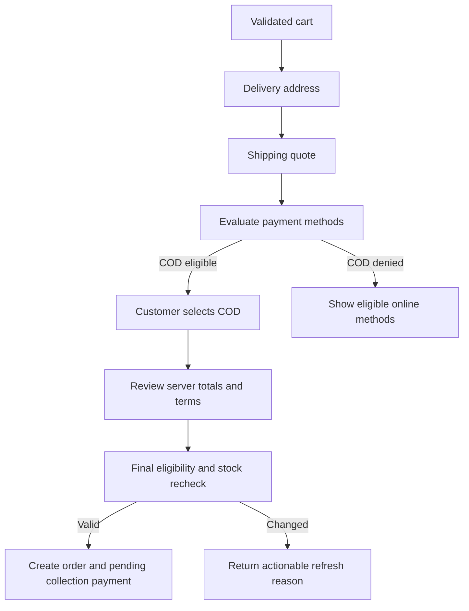

# Cash on Delivery and Payment Plan

## Purpose

Cash on Delivery (COD) reusable B2C marketplace-এর first-class payment method। COD-কে online payment-এর অনুপস্থিতি হিসেবে নয়, নিজস্ব configuration, eligibility, lifecycle, audit এবং reconciliationসহ payment flow হিসেবে design করতে হবে।

## Core invariants

- Customer checkout-এ COD select করতে পারবে যদি eligibility engine allow করে।
- Admin COD globally enable/disable করতে পারবে।
- Zone, location, product, category, order amount এবং operational risk rule COD সীমিত করতে পারবে।
- COD order online charge ছাড়াই create হবে।
- Initial COD payment status হবে `PENDING_COLLECTION`।
- Order, payment এবং fulfillment status স্বাধীন থাকবে।
- Delivery status নিজে থেকে payment collected করবে না।
- Collection actor, amount, currency, timestamp এবং note audit করা হবে।
- Client eligibility বা total authoritative নয়; placement-এর সময় server পুনরায় evaluate করবে।

## Recommended status model

### Order status

```text
PLACED
CONFIRMED
CANCELLED
COMPLETED
```

### Payment status

```text
UNPAID
PENDING
PENDING_COLLECTION
PAID
COLLECTED
FAILED
PARTIALLY_REFUNDED
REFUNDED
```

### Fulfillment status

```text
UNFULFILLED
PROCESSING
SHIPPED
DELIVERED
RETURNED
```

Initial COD state:

```text
orderStatus       = PLACED
paymentStatus     = PENDING_COLLECTION
fulfillmentStatus = UNFULFILLED
paymentMethod     = CASH_ON_DELIVERY
```

Order status fulfillment progress mirror করে না। Delivery-এর পরে collection pending থাকলে order `CONFIRMED`, fulfillment `DELIVERED`, payment `PENDING_COLLECTION` থাকতে পারে। Required payment/waiver এবং return obligations resolved হওয়ার পরে explicit policy order-কে `COMPLETED` করবে।

## COD configuration

Recommended settings:

| Setting | Meaning |
|---|---|
| `enabled` | Global COD availability |
| `minimumOrderAmount` | COD-এর জন্য minimum payable total |
| `maximumOrderAmount` | COD-এর জন্য maximum payable total |
| `allowedZoneIds` | Explicit allowed delivery zones |
| `blockedZoneIds` | Explicit denied zones |
| `blockedProductIds` | COD-ineligible products |
| `blockedCategoryIds` | COD-ineligible categories |
| `maximumItemQuantity` | Optional risk control |
| `requireVerifiedPhone` | Optional customer requirement |
| `collectionInstructions` | Customer/admin operational note |
| `ruleVersion` | Eligibility snapshot traceability |

Provider secrets বা sensitive fraud rules public/admin-readable settings response-এ leak করা যাবে না।

## Eligibility precedence

Evaluator এই order-এ check করবে:

1. COD globally enabled।
2. Customer এবং address required fields complete।
3. Optional phone verification requirement।
4. Delivery zone matched এবং COD-supported।
5. কোনো product explicitly blocked কি না।
6. কোনো category blocked কি না।
7. Minimum/maximum payable amount।
8. Quantity বা risk constraints।
9. অন্য কোনো active deny rule।

নীতি: **deny overrides allow**।

Result shape conceptually:

```text
eligible: false
reasonCode: COD_PRODUCT_RESTRICTED
evaluatedAt: timestamp
ruleVersion: version
```

Reason codes UI localization এবং support troubleshooting-এ ব্যবহার হবে। Raw internal rule বা sensitive score customer-কে দেখানো হবে না।

## Checkout flow



## Placement transaction

COD order transaction should coordinate:

1. Idempotency key claim।
2. Checkout/cart version check।
3. Product status, price এবং inventory revalidation।
4. Coupon এবং delivery quote revalidation।
5. COD eligibility re-evaluation।
6. Inventory reserve/commit।
7. Order এবং order-item snapshots।
8. Payment record with `PENDING_COLLECTION`।
9. COD evaluation snapshot।
10. Order-created outbox event।

কোনো failure partial order বা stock loss রেখে যাবে না।

## Collection workflow

- Authorized admin/support/fulfillment actor order detail থেকে collection action নেবে।
- Expected collectible amount UI-তে read-only reference হবে।
- Submitted amount এবং currency server validate করবে।
- Collection action idempotent হবে।
- Result payment status `COLLECTED` হবে।
- Actor, amount, timestamp, note এবং optional external receipt reference থাকবে।
- Expected amount-এর সঙ্গে mismatch হলে anomaly flag হবে।
- Existing collection record delete করা যাবে না; correction reversal/audit workflow ব্যবহার করবে।

## Cancellation and return

| Situation | Required behavior |
|---|---|
| COD cancelled before collection | Pending collection close; stock/coupon release |
| COD collected then cancelled | Refund/reversal workflow required |
| Full return after collection | Refund record এবং returned fulfillment state |
| Partial return | Collected amount retained; partial refund tracked separately |
| Delivered but uncollected | Operational anomaly এবং admin alert/report |
| Duplicate collection request | Existing result return বা conflict; second collection নয় |

## Online payment architecture

Online provider adapter minimum contract:

- Create payment intent/session।
- Verify/capture provider state।
- Validate webhook signature।
- Normalize provider event।
- Full/partial refund request।
- Fetch/reconcile transaction status।

Redirect success page payment success-এর authoritative evidence নয়। Verified webhook বা server-to-server provider verification authoritative হবে।

## Required edge cases

- Checkout চলাকালে admin COD disable করে।
- Address change-এ delivery zone/COD eligibility বদলায়।
- Cart-এর একটি blocked product পুরো COD method block করে।
- Amount coupon-এর পরে min/max threshold cross করে।
- Duplicate checkout submit।
- Last stock concurrent purchase।
- Order create-এর আগে settings version change।
- Collected COD-তে duplicate admin click।
- COD order cancellation before এবং after collection।
- Partial return/refund।
- Delivered কিন্তু collection pending।
- Zero-value order।
- Unsupported currency।
- Online webhook duplicate, forged বা out-of-order।

## Related tasks

- Foundation: P2-05, P2-06, P2-08, P2-10।
- Checkout: P4-06, P4-10 through P4-15।
- Payment/COD: P5-01 through P5-13।
- Order operations: P6-01 through P6-11।
- Admin configuration: P7-06 through P7-08।
- Verification: P9-03, P9-08, P9-10 through P9-12।
