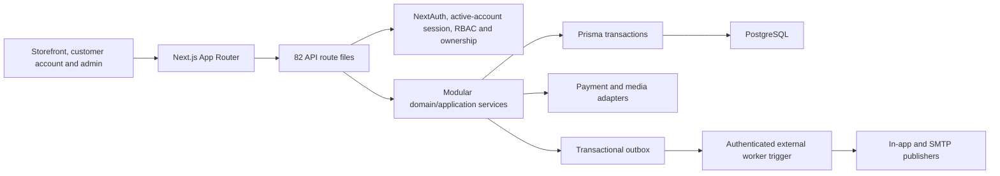

# Current Project Analysis

## Status

**Implementation snapshot current; Phase 9 verification in progress.**

এই analysis 2026-07-25-এর shared `dev` worktree-এর source, route handlers,
Prisma schema, migrations এবং current documentation audit করে তৈরি। Worktree
এখনও release commit নয়; exact commit SHA, clean-worktree review, browser suite
এবং final release decision Phase 9-এ record হবে।

## Executive summary

Marketplace এখন আর property/rental starter নয়। এটি configurable,
single-business reusable B2C **modular monolith**:

- Next.js storefront, customer account এবং admin/operations surface;
- PostgreSQL/Prisma authoritative commerce persistence;
- role ও ownership-aware APIs;
- Product/Variant/Inventory, Cart, Checkout, COD, payment adapter, Order,
  Shipment, Return, Coupon, Review, Notification, Support এবং Settings modules;
- transactional outbox, in-app notification এবং SMTP boundary;
- business/branding/payment/COD/delivery/homepage configuration;
- explicit legacy route retirement।

Current source inventory:

| Inventory                               | Current count |
| --------------------------------------- | ------------: |
| `src/app/api/**/route.ts` files         |            82 |
| HTTP method/path contracts              |           117 |
| Prisma models                           |            43 |
| Prisma enums                            |            23 |
| Committed migration directories         |             8 |
| Vitest test files under `src/__tests__` |            35 |
| Playwright spec files under `e2e`       |             3 |

এই count implementation presence প্রমাণ করে; deployed reachability, live
provider callback বা final Phase 9 acceptance-এর বিকল্প নয়।

## Current architecture

Canonical implementation details:

- [Architecture](./ARCHITECTURE.md)
- [Database schema](./DATABASE_SCHEMA.md)
- [API documentation](./API_DOCUMENTATION.md)
- [Operations runbook](./OPERATIONS_RUNBOOK.md)

## Technology inventory

| Layer          | Current implementation                                                                  |
| -------------- | --------------------------------------------------------------------------------------- |
| Frontend       | Next.js 15.5, React 18.3, TypeScript 5.9, MUI 5/Emotion                                 |
| Routing        | Next.js App Router with locale segment and Route Handlers                               |
| Backend        | Validated API handlers plus modular services under `src/lib/services` and `src/modules` |
| Database       | PostgreSQL datasource, Prisma 5.6, eight ordered SQL migrations                         |
| Authentication | NextAuth 4 Credentials Provider, JWT, active status and session-version invalidation    |
| Localization   | `next-intl`, English/Bengali/Arabic customer-facing messages                            |
| Email/events   | Nodemailer SMTP adapters, database outbox and in-app notification projection            |
| Testing        | Vitest 4, Testing Library, PostgreSQL integration suite, Playwright 1.61                |
| Tooling        | pnpm 10, Node.js 22 release contract, Docker Compose, ESLint, Prettier                  |

The local documentation audit ran under Node.js 24.12.0, while
`package.json`, `.nvmrc` and CI define Node.js 22.x as release-authoritative.

## Module status

| Capability         | Current status                      | Implemented behavior                                                                                           | Deployment-dependent or residual                                              |
| ------------------ | ----------------------------------- | -------------------------------------------------------------------------------------------------------------- | ----------------------------------------------------------------------------- |
| Authentication     | Implemented                         | Registration, credentials, verification, recovery, password change, active-account/session-version enforcement | Live SMTP delivery must be certified                                          |
| Authorization      | Implemented                         | `user`, `admin`, `support`, `catalog_manager`; API-side role and ownership policy                              | Final browser/IDOR gate remains Phase 9                                       |
| Customer account   | Implemented                         | Profile, address book, cart merge, orders, wishlist, notification/preferences                                  | Production operator smoke pending                                             |
| Product/catalog    | Implemented                         | Product, variants, SKU, media metadata, category, publish/archive, public catalog                              | Binary object-storage provider is not implemented                             |
| Inventory          | Implemented                         | On-hand/reserved balances, atomic reserve/commit/release/adjust and ledger                                     | Production load/monitoring remains environment-specific                       |
| Search/filter/sort | Implemented                         | Bounded catalog search, category, price, availability, sorting, suggestions and pagination                     | Dedicated search engine is not part of core                                   |
| Cart               | Implemented                         | Signed guest identity, authenticated cart, quantity rules, merge, repricing and expiry                         | Multi-instance session behavior still depends on shared DB/secret consistency |
| Checkout           | Implemented                         | Snapshot, address, delivery, coupon, authoritative totals, expiry and idempotent placement                     | Final E2E/browser gate pending                                                |
| Cash on Delivery   | Implemented                         | Admin-configurable eligibility by enablement, amount, zone, product/category, quantity and phone rule          | Business collection procedure requires operator approval                      |
| Online payment     | Adapter-ready limitation            | Intent/webhook/reconciliation/refund contract and signed `MOCK` adapter                                        | No production provider implemented or certified                               |
| Order              | Implemented                         | Multi-item snapshots, independent status/version/history, customer/admin queries and cancellation              | Financial retention policy remains operational                                |
| Shipping/returns   | Implemented                         | Zones, methods, quote, shipment allocation/tracking/status and return workflow                                 | No live carrier adapter/certification                                         |
| Coupon             | Implemented                         | Type, scope, window, amount and usage limits with checkout revalidation                                        | Admin list currently hard-capped rather than paginated                        |
| Reviews            | Implemented                         | Delivered-purchase eligibility, moderation and approved aggregates                                             | Final browser moderation journey pending                                      |
| Notifications      | Implemented                         | Outbox, idempotent in-app projection, preferences and SMTP templates                                           | No repository scheduler; live SMTP acceptance unverified                      |
| Support            | Implemented                         | Rate-limited contact/listing-report intake, opaque reference, staff PII queue and versioned workflow           | External helpdesk integration is not included                                 |
| Business settings  | Implemented                         | Business, branding, payment presentation, COD rules, delivery, coupon and content settings                     | Some configuration collections use fixed caps without pagination              |
| Homepage content   | Implemented with protected boundary | Revisioned lower-homepage sections; protected keys prevent Hero/Search replacement                             | Hero/Search final visual regression gate pending                              |
| Admin/reporting    | Implemented                         | Dashboard KPIs, customer/order/catalog/inventory/settings/support/review operations, audit and capped exports  | Large-dataset pagination/export policy needs further hardening                |
| Documentation      | Implemented; final audit active     | Architecture, schema, API, feature, admin, customization, deployment, testing, operations and release docs     | Final Phase 9 source/link/browser sign-off pending                            |

## Commerce consistency and security

Implemented invariants include:

- Currency-safe Prisma `Decimal` persistence and server-authoritative totals.
- Order, payment and fulfillment use separate statuses.
- COD order payment starts `PENDING_COLLECTION`; staff collection changes it to
  `COLLECTED` without implicitly completing order/fulfillment.
- Placement, webhook, collection, refund, resource release, notification and
  support mutations use idempotency or optimistic versioning where required.
- Inventory prevents negative/over-reserved balances and records a ledger.
- Order item, price and address snapshots preserve purchase history.
- Payment webhook verifies a raw-body HMAC signature, caps body size and
  reconciles replay/out-of-order events.
- Worker bearer authentication is separate from customer/admin session auth.
- Settings reject secret-like input; public settings expose an allow-list.
- Support public responses omit submitted PII; staff reads are role-gated.

## Admin, customer and support surfaces

The current UI/API scope includes:

- customer catalog, product detail, cart, checkout, order history/detail,
  cancellation, return, wishlist, review, notification and support flows;
- admin catalog/category/inventory, order/fulfillment/COD/refund, customer,
  coupon, content, settings, review moderation, support, audit and reporting;
- operational roles for `admin`, `support` and `catalog_manager`;
- customer/staff APIs documented method-by-method in
  [API documentation](./API_DOCUMENTATION.md).

Presence of a route or page does not by itself close Phase 9; browser,
accessibility, visual and clean-release gates must still pass.

## Legacy retirement boundary

Legacy property/rental tables remain for migration/archive compatibility, but
they are not the current B2C source of truth. Explicit retired HTTP contracts:

| Retired contract           | Successor                 |
| -------------------------- | ------------------------- |
| `GET                       | POST /api/listings`→`410` | `/api/catalog`                      |
| `GET                       | POST /api/reviews`→`410`  | `/api/products/{productId}/reviews` |
| `POST /api/orders` → `410` | `/api/checkout/place`     |

Retired responses use `Cache-Control: no-store`, `Deprecation: true` and a
successor `Link`. Peer-to-peer `Message` storage is legacy; current B2C customer
contact uses `SupportRequest`.

## Design and customization boundary

- Homepage overall composition এবং বিশেষ করে Hero/Search strict protected
  visual contract।
- Copy, locale, product terminology, dynamic data এবং search behavior
  configurable/evolvable।
- Lower homepage content revisioned settings দিয়ে পরিচালিত।
- Product, account, checkout এবং admin surface business-fit অনুযায়ী redesign
  করা যায়।
- MUI current implementation choice, template-wide restriction নয়।
- Per-business deployment, business-owned catalog এবং configuration-first
  customization core scope; runtime multi-tenant SaaS ও multi-vendor settlement
  core নয়।

## Current residual risks and non-claims

1. **Production online payment:** only `MOCK` is registered. A real adapter,
   provider sandbox, webhook certification and finance reconciliation are
   required before enabling online payment.
2. **Production media storage:** `MediaStorageAdapter` exists, but default
   `LocalMediaAdapter` writes local files and product media APIs primarily store
   URL metadata. Durable object storage/CDN upload lifecycle is not implemented
   or certified.
3. **Distributed rate limiting and proxy trust:** limiter storage is
   process-local. Several public flows derive identity from
   `x-forwarded-for`/`x-real-ip` without a configured trusted-proxy boundary.
   Production needs trusted edge normalization and shared/WAF enforcement.
4. **CSP nonce:** security headers exist, but current CSP allows
   `script-src 'unsafe-inline'` and has no per-request nonce/hash policy.
5. **Admin configuration scale:** products/orders/customers/audit/support use
   pagination, but category, coupon, content, inventory and delivery reads use
   fixed caps such as 100/500/1,000; reports truncate at 5,000. Larger
   businesses need explicit pagination/cursor and operator feedback.
6. **SMTP and scheduler certification:** outbox worker and SMTP adapters are
   implemented, but no scheduler deployment exists in the repository and no
   provider-side SMTP delivery/bounce evidence is verified.
7. **Backup/retention:** a local migration/restore rehearsal passed, but
   production backup automation, RPO/RTO, retention/pruning jobs and live
   restore evidence are deployment responsibilities.
8. **Financial deletion policy:** current cascades can remove order/payment
   history if a root user/order is hard-deleted. Operations must suspend/archive
   until an approved anonymization/retention migration changes this boundary.
9. **Phase 9 authority:** current source/docs inspection does not replace the
   pending full browser, accessibility, visual, exact-worktree and final
   release gates.

## Verification status

This documentation refresh verified:

- source/API inventory: 82 route files and 117 unique method/path contracts;
- schema inventory: 43 models and 23 enums;
- migration inventory: eight committed migration directories;
- `pnpm exec prisma validate`;
- documentation Prettier, internal-link and fenced-block integrity for the
  refreshed files।

Phase 9 still requires the complete sequence in
[Testing Guide](./TESTING_GUIDE.md) and a signed
[Release Checklist](./RELEASE_CHECKLIST.md). The local
[Phase 9 Migration and Recovery Rehearsal](./evidence/phase-9/MIGRATION_REHEARSAL.md)
is passing evidence, but it ran under Node.js 24 and does not certify production
hosting, provider or browser behavior.

## Historical Phase 1 baseline

The 2026-07-05 Phase 1 evidence correctly described the repository **at that
time** as a property/rental starter with missing commerce capabilities. It is
preserved in:

- [Phase 1 SQA Audit](./PHASE_1_SQA_AUDIT.md)
- [Phase 1 Exit Approval](./PHASE_1_EXIT_APPROVAL.md)
- [Historical Route/API Inventory](./P1-02_ROUTE_API_INVENTORY.md)
- [Phase 1 Migration Planning Rehearsal](./evidence/phase-1/MIGRATION_PLANNING_REHEARSAL.md)

Those records prove the planning baseline and governance history; their
property-starter/missing-feature statements are not current implementation
facts.

## Phase position

| Phase      | Current status                                                   |
| ---------- | ---------------------------------------------------------------- |
| Phases 1–8 | **Complete — implementation present**                            |
| Phase 9    | **In Progress — final verification/release gate not yet closed** |

The application is now a reusable B2C marketplace implementation candidate,
not yet a certified production release. Final readiness depends on exact-source
gates, browser evidence and environment/provider certification.
