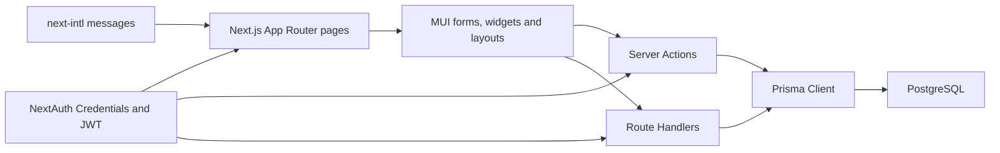

# Current Project Analysis

## Executive summary

বর্তমান codebase একটি Next.js property/rental listing marketplace starter। Authentication, PostgreSQL/Prisma, listing/category, booking-style order, review, bookmark, i18n এবং MUI design foundation আছে। এটি এখনো reusable retail B2C marketplace নয়।

প্রধান ব্যবধান:

- `Listing` domain property/rental-specific।
- Cart, inventory, checkout, shipping, COD, online payment, coupon, admin panel ও business settings নেই।
- বর্তমান `Order` একটি listing/date booking; multi-item commerce order নয়।
- Admin role seed করা হলেও RBAC ও admin UI নেই।
- অনেক form/page visual shell; submit handler empty বা data hardcoded।
- Money `Float` এবং role/status free-form `String`।
- কিছু mutation ownership বা role authorization ছাড়াই callable।

## Current architecture

## Technology inventory

| Layer | Current choice |
|---|---|
| Frontend | Next.js 15, React 19, TypeScript, MUI 5, Emotion |
| Routing | Next.js App Router এবং locale route segment |
| Backend | Route Handlers এবং `use server` functions |
| Database | PostgreSQL 15 এবং Prisma 5 |
| Authentication | NextAuth v4 Credentials Provider, JWT session |
| Localization | `next-intl`, eight locale files |
| Testing | Vitest, Testing Library, jsdom |
| Tooling | pnpm, Docker Compose, Storybook, ESLint |

## Module status

| Area | Status | Existing capability | Missing or incomplete |
|---|---|---|---|
| Frontend | Partial | Responsive MUI layouts, listing/search/account pages | No-op forms, mock data, incomplete workflows |
| Backend | Partial | Route Handlers ও server actions | Duplicate business logic, no domain service boundary |
| Database | Partial | User, Account, Listing, Category, Order, Review, Message, Bookmark | Product, variant, inventory, cart, payment, shipment, coupon, settings |
| Authentication | Partial | Registration, credentials login, JWT session | Verification, reset, account status, role-aware session |
| Authorization | Missing | Logged-in route protection | RBAC, ownership policy, admin policy |
| Customer account | Partial | Account model ও account routes | Real profile wiring, address book, functional settings |
| Seller/merchant | Legacy/partial | Listing owner relation | Merchant page mock; no clear B2C ownership boundary |
| Admin | Missing | Seeded `admin` role | Admin routes, UI, policies, audit trail |
| Product/catalog | Wrong domain | Property-oriented `Listing` | Product, SKU, variant, attributes, tax class |
| Category | Partial | Hierarchical model ও read query | CRUD, ordering, visibility, safe archive |
| Inventory | Missing | None | Balance, reservation, adjustment, threshold |
| Search | Partial | Text, price, category, bedroom backend filters | UI wiring, facets, sort, URL state |
| Wishlist | Partial | Bookmark persistence | Product card only toggles local state |
| Cart | Missing | None | Guest/auth cart, quantities, merge, repricing |
| Checkout | Missing | Booking form shell | Address, delivery, coupon, payment, finalization |
| COD | Missing | None | Settings, eligibility, pending collection, collection action |
| Online payment | Missing | None | Provider adapter, intent, webhook, refund |
| Orders | Legacy/partial | Single-listing booking order | Multi-item snapshots, payment and fulfillment state |
| Shipping | Missing | Listing location only | Zones, methods, rates, shipment, tracking |
| Coupons | Missing | Listing discount field only | Coupon lifecycle, scope, limits, evaluator |
| Reviews | Partial | Listing review persistence | Verified purchase, moderation, correct aggregates |
| Notifications | Missing | `nodemailer` installed | Templates, outbox, preferences, in-app notice |
| Business settings | Minimal | Marketplace name/domain env | Currency, tax, contact, operational rules |
| Branding | Minimal | Theme এবং env name | Logo, theme tokens, SEO, social links settings |
| Homepage content | Hardcoded | Existing visual sections | Configurable order, visibility, localized content |
| Analytics | Mock | Dashboard/chart components | Real aggregate queries ও exports |
| Documentation | Partial | README, Docker docs, Storybook | Architecture, schema, API, admin, customization guides |

## Verified baseline

Analysis-এর সময় নিম্নলিখিত read-only checks চালানো হয়েছে:

| Check | Result |
|---|---|
| `pnpm test:run` | 2 suites এবং 25 tests passed |
| TypeScript check with incremental output disabled | Passed |
| `pnpm lint` | Passed; `next lint` deprecated warning আছে |
| `pnpm format:check` | Failed কারণ `prettier` executable direct dependency হিসেবে নেই |
| `pnpm exec prisma validate` | Environment-এ `POSTGRES_URL_NON_POOLING` না থাকায় failed |
| Git status before planning edits | Clean |

## High-risk findings

1. `updateUser` caller-provided user ID update করে; self/admin policy নেই।
2. Listing create/update/delete server functions authentication বা ownership enforce করে না।
3. `updateOrderStatus` arbitrary string গ্রহণ করে এবং authorization enforce করে না।
4. NextAuth session-এ role বা account status নেই।
5. Middleware dynamic-public-route regular expression ambiguous।
6. Listing detail query published status enforce করে না।
7. যেকোনো authenticated user purchase ছাড়াই review দিতে পারে।
8. Money `Float` হওয়ায় rounding/accounting risk আছে।
9. User বা listing cascade deletion order history মুছে দিতে পারে।
10. JSON order API-র `z.date()` ISO string coercion করে না।
11. In-memory rate limiter distributed deployment-এ shared নয় এবং cleanup policy নেই।
12. `zod`, `react-hook-form`, `uuid` direct source import হলেও direct dependency হিসেবে declared নয়।
13. Booking, listing creation, account settings, password, media, contact, report এবং messaging forms-এর কিছু submit handler empty।
14. Search filter controls backend query-তে সম্পূর্ণভাবে wired নয়।
15. Dashboard, account, merchant এবং message experiences mock/hardcoded data ব্যবহার করে।
16. Prisma migration history নেই; schema push workflow-এর উপর নির্ভরতা আছে।
17. Docker Compose host port `5433`, কিন্তু Docker documentation-এ একাধিক জায়গায় `5432`।
18. README কিছু incomplete capability-কে implemented feature হিসেবে দাবি করে।

## Current file boundaries

- `src/app`: routes, layouts এবং Route Handlers।
- `src/forms`: customer/listing/search form presentation।
- `src/widgets`: page-level UI sections; mock এবং live data mixed।
- `src/server`: Prisma-backed server functions।
- `src/lib`: auth, Prisma, validation, rate limiting।
- `src/global`: routes, types, static data, site config।
- `src/theme`: MUI theme এবং overrides।
- `prisma`: current schema এবং seed; migration directory নেই।
- `messages`: locale message JSON files।
- `docs`: বর্তমানে Storybook content এবং নতুন planning documents।

## Conclusion

Codebase-টি ফেলে দিয়ে নতুন application শুরু করার প্রয়োজন নেই। Design system, route shell, i18n, auth baseline এবং কিছু persisted entities reuse করা যায়। তবে commerce correctness-এর জন্য Product, Inventory, Cart, Checkout, Payment, Order এবং Fulfillment domain নতুন modular boundary-তে তৈরি করতে হবে; existing rental schema-কে সরাসরি retail semantics দিয়ে overload করা উচিত নয়।
