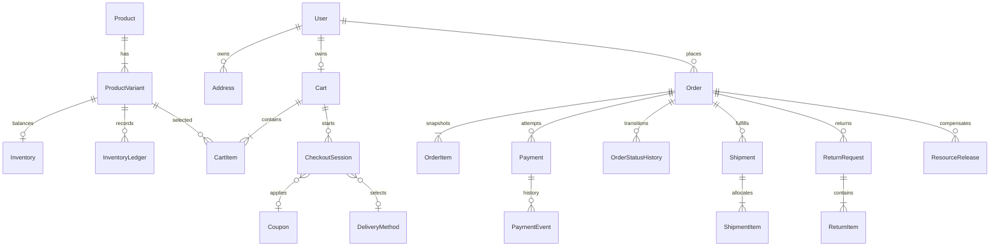
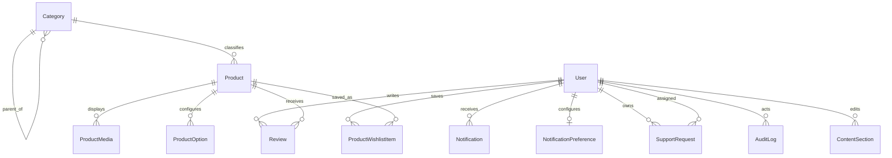

# Database Schema

## Status and evidence

এই document 2026-07-25 তারিখের `prisma/schema.prisma` এবং আটটি committed
SQL migration-এর implementation snapshot। বর্তমান schema-তে 43টি model এবং
23টি enum আছে। Prisma schema-এর পাশাপাশি raw migration-এর partial unique index
ও `CHECK` constraint-ও authoritative; শুধু generated Prisma types দেখে database
contract সম্পূর্ণ বোঝা যাবে না।

Deployment-dependent facts:

- কোন production database-এ সব migration apply হয়েছে তা এই audit যাচাই করেনি।
- Production row counts, data quality, PostgreSQL extensions, backup schedule,
  RPO/RTO এবং restore success অজানা।
- Repository-তে automated backup, restore বা retention job নেই।

## High-level ERD

### Commerce core



### Experience and operations



`Listing`, listing-oriented `Review`, `Message` and `Bookmark` remain as legacy
storage. Their public write/read APIs are retired where documented in
`API_DOCUMENTATION.md`; they are not the reusable B2C commerce source of truth.

## Enum and status registry

| Enum                     | Values                                                                                                                  | Meaning                                      |
| ------------------------ | ----------------------------------------------------------------------------------------------------------------------- | -------------------------------------------- |
| `UserRole`               | `user`, `admin`, `support`, `catalog_manager`                                                                           | RBAC role                                    |
| `UserStatus`             | `active`, `suspended`, `pending_verification`                                                                           | Account/session eligibility                  |
| `ProductStatus`          | `draft`, `published`, `archived`                                                                                        | Commerce catalog visibility                  |
| `ListingStatus`          | `draft`, `published`, `archived`                                                                                        | Legacy listing visibility                    |
| `ListingType`            | `rent`, `sale`                                                                                                          | Legacy listing type                          |
| `OrderStatus`            | `pending`, `confirmed`, `cancelled`, `completed`                                                                        | Commercial order lifecycle                   |
| `PaymentStatus`          | `UNPAID`, `PENDING`, `PENDING_COLLECTION`, `PAID`, `COLLECTED`, `FAILED`, `CANCELLED`, `PARTIALLY_REFUNDED`, `REFUNDED` | Payment lifecycle independent of order       |
| `FulfillmentStatus`      | `UNFULFILLED`, `PROCESSING`, `SHIPPED`, `DELIVERED`, `RETURNED`                                                         | Aggregate fulfillment independent of payment |
| `ShipmentStatus`         | `PENDING`, `PROCESSING`, `SHIPPED`, `DELIVERED`, `RETURNED`, `CANCELLED`                                                | Individual shipment lifecycle                |
| `ReturnStatus`           | `REQUESTED`, `APPROVED`, `REJECTED`, `RECEIVED`, `COMPLETED`                                                            | Return workflow                              |
| `CheckoutSessionStatus`  | `active`, `expired`, `completed`                                                                                        | Checkout snapshot lifecycle                  |
| `InventoryEntryType`     | `reservation`, `commit`, `release`, `adjustment`                                                                        | Ledger reason type                           |
| `DiscountType`           | `percentage`, `fixed`                                                                                                   | Coupon calculation                           |
| `CouponScope`            | `all`, `category`, `product`                                                                                            | Coupon applicability                         |
| `AddressType`            | `shipping`, `billing`                                                                                                   | Customer address use                         |
| `OutboxStatus`           | `PENDING`, `PROCESSING`, `PUBLISHED`, `FAILED`                                                                          | Worker claim/delivery state                  |
| `ResourceReleaseType`    | `INVENTORY`, `COUPON`                                                                                                   | Compensation target                          |
| `OrderTransitionKind`    | `ORDER`, `FULFILLMENT`                                                                                                  | History row discriminant                     |
| `ContentSectionStatus`   | `draft`, `published`, `archived`                                                                                        | Revision visibility                          |
| `ReviewStatus`           | `PENDING`, `APPROVED`, `REJECTED`, `HIDDEN`, `FLAGGED`                                                                  | Review moderation                            |
| `SupportRequestStatus`   | `OPEN`, `IN_PROGRESS`, `WAITING_FOR_CUSTOMER`, `RESOLVED`, `CLOSED`                                                     | Support lifecycle                            |
| `SupportRequestPriority` | `LOW`, `NORMAL`, `HIGH`, `URGENT`                                                                                       | Staff triage                                 |
| `SupportRequestSource`   | `CONTACT`, `LISTING_REPORT`                                                                                             | Intake origin                                |

## State transition contracts

### Order

```text
pending -> confirmed | cancelled
confirmed -> completed | cancelled
cancelled -> terminal
completed -> terminal
```

### Fulfillment

```text
UNFULFILLED -> PROCESSING -> SHIPPED -> DELIVERED -> RETURNED
```

### Payment

```text
UNPAID -> PENDING | PENDING_COLLECTION | CANCELLED
PENDING -> PAID | FAILED | CANCELLED
PENDING_COLLECTION -> COLLECTED | CANCELLED
PAID | COLLECTED -> PARTIALLY_REFUNDED | REFUNDED
PARTIALLY_REFUNDED -> PARTIALLY_REFUNDED | REFUNDED
FAILED | CANCELLED | REFUNDED -> terminal
```

Duplicate non-partial states are no-op. Paid/collected/refunded progress does not
regress on late `PENDING`, `FAILED` or `CANCELLED` webhooks.

### Shipment

```text
PENDING -> PROCESSING | CANCELLED
PROCESSING -> SHIPPED | CANCELLED
SHIPPED -> DELIVERED
DELIVERED -> RETURNED
RETURNED | CANCELLED -> terminal
```

### Return

```text
REQUESTED -> APPROVED | REJECTED
APPROVED -> RECEIVED | REJECTED
RECEIVED -> COMPLETED
REJECTED | COMPLETED -> terminal
```

### Support

```text
OPEN -> IN_PROGRESS | RESOLVED | CLOSED
IN_PROGRESS -> OPEN | WAITING_FOR_CUSTOMER | RESOLVED | CLOSED
WAITING_FOR_CUSTOMER -> IN_PROGRESS | RESOLVED | CLOSED
RESOLVED -> IN_PROGRESS | CLOSED
CLOSED -> OPEN
```

Support same-state updates are permitted because assignment, priority or
internal note may change independently. `version` protects against concurrent
staff overwrite.

## Model registry

The “key fields” column lists persistence-significant fields; timestamps and
obvious relation arrays are omitted where they add no contract detail.

### Identity and customer

| Model               | Key fields                                                                     | Important relations and constraints                        |
| ------------------- | ------------------------------------------------------------------------------ | ---------------------------------------------------------- |
| `User`              | `email`, bcrypt `password`, `role`, `status`, `sessionVersion`, profile fields | Unique email; root for account/customer/staff relations    |
| `Account`           | `bio`, `phone`, `userId`                                                       | One-to-one unique `userId`; cascades with user             |
| `UserMedia`         | `url`, `type`, `userId`                                                        | User-owned metadata; cascade                               |
| `Address`           | type, label, address/phone fields, `isDefault`                                 | User-owned; partial unique one default per `(userId,type)` |
| `ResetToken`        | unique `userId`, unique token, `expiresAt`, `used`                             | One active stored token per user                           |
| `VerificationToken` | unique `userId`, unique token, `expiresAt`, `used`                             | One active stored token per user                           |

### Catalog and legacy listing

| Model            | Key fields                                                                             | Important relations and constraints                          |
| ---------------- | -------------------------------------------------------------------------------------- | ------------------------------------------------------------ |
| `Category`       | unique name/slug, parent, display order, active flag                                   | Self-relation; parent delete sets null                       |
| `Product`        | unique slug, name, description, status, brand, tax class, category, legacy ID, creator | Creator is required; category nullable                       |
| `ProductVariant` | unique SKU, barcode, decimal price/compare price, weight                               | Cascade with product; nonnegative weight check               |
| `ProductOption`  | name, JSON values                                                                      | Cascade with product                                         |
| `ProductMedia`   | URL, alt, order, primary flag                                                          | One primary per product enforced by partial unique SQL index |
| `Listing`        | unique slug, decimal price/discount, rental/property fields                            | Legacy model; nonnegative money check                        |
| `Message`        | content/read, sender/receiver                                                          | Legacy peer chat storage; both relations cascade             |
| `Bookmark`       | user/listing                                                                           | Unique `(userId,listingId)` legacy relationship              |

### Inventory, cart and checkout

| Model             | Key fields                                                                       | Important relations and constraints                                   |
| ----------------- | -------------------------------------------------------------------------------- | --------------------------------------------------------------------- |
| `Inventory`       | unique variant, `onHand`, `reserved`, threshold                                  | `0 <= reserved <= onHand`; nonnegative threshold                      |
| `InventoryLedger` | variant, entry type, signed quantity, reason/reference, actor                    | Indexed by variant, actor and reference tuple                         |
| `Cart`            | exactly one of user or signed session token, currency, subtotal, version, expiry | Unique user/token; XOR identity check                                 |
| `CartItem`        | variant/product snapshot, price, quantity                                        | Unique `(cartId,variantId)`; quantity 1–100                           |
| `CheckoutSession` | cart/version, owner, status, totals, coupon, delivery, address refs, expiry      | Nonnegative totals; one active checkout per cart partial unique index |
| `DeliveryZone`    | unique slug, country/region/postal arrays, active, priority                      | Indexed active/priority                                               |
| `DeliveryMethod`  | zone/code, price, free threshold, weight/day windows, active                     | Unique `(zoneId,code)`; price/weight range checks                     |
| `Coupon`          | unique code, type/value, amount limits, scope JSON, usage limits/window          | Value/date/scope checks; active index                                 |
| `CouponUsage`     | coupon/order/user, used/released metadata                                        | Unique `(couponId,orderId)`; release lookup index                     |
| `IdempotencyKey`  | globally unique key, user, JSON response                                         | Persists replay result for order placement                            |

### Order, payment and fulfillment

| Model                | Key fields                                                                                                     | Important relations and constraints                                 |
| -------------------- | -------------------------------------------------------------------------------------------------------------- | ------------------------------------------------------------------- |
| `Order`              | unique order number/idempotency key, three statuses, version, decimal totals, currency, snapshots, placed time | Owns item/payment/history/shipment/return/release records           |
| `OrderItem`          | optional product/variant IDs plus immutable SKU/name/price/quantity/total                                      | Positive quantity and nonnegative amount check                      |
| `OrderStatusHistory` | order sequence, transition kind, from/to pairs, actor/reason/metadata                                          | Unique `(orderId,sequence)`; sequence and discriminated-pair checks |
| `Payment`            | order, amount, cumulative refunded amount, currency, status, provider, unique provider ref, attempts           | `0 <= refundedAmount <= amount`; status/provider indexes            |
| `PaymentEvent`       | payment, optional unique idempotency key, type, from/to, metadata                                              | Append-oriented event history                                       |
| `Shipment`           | order, status, carrier/service/tracking, estimate/timestamps, metadata                                         | Order/status/tracking indexes                                       |
| `ShipmentItem`       | shipment, order item, quantity                                                                                 | Unique allocation per shipment/item; quantity positive              |
| `ReturnRequest`      | order/requester, status, reason/resolution, refund/currency/timestamps                                         | Refund nonnegative; status indexes                                  |
| `ReturnItem`         | request, order item, quantity/reason/condition                                                                 | Unique request/item; quantity positive                              |
| `ResourceRelease`    | order, type/resource/quantity, unique idempotency key, metadata                                                | Prevents duplicate inventory/coupon compensation                    |

### Experience, support and operations

| Model                    | Key fields                                                                                           | Important relations and constraints                                           |
| ------------------------ | ---------------------------------------------------------------------------------------------------- | ----------------------------------------------------------------------------- |
| `Review`                 | listing XOR product, optional unique order item, rating/comment, verified flag, moderation           | Exactly one target; verified/product/order checks; one user review per target |
| `ContentSection`         | section/locale/status/order/visibility/content/revision/editor                                       | Unique revision identity and one published revision partial unique index      |
| `ProductWishlistItem`    | user/product                                                                                         | Unique `(userId,productId)`                                                   |
| `Notification`           | user, unique source event, type/copy/data/read/expiry                                                | Event-idempotent projection; user/read/time indexes                           |
| `NotificationPreference` | unique user; transactional/marketing channel flags                                                   | Transactional flags default enabled                                           |
| `SupportRequest`         | unique opaque reference, optional owner/assignee, source/status/priority, PII, context/note, version | Version positive; staff queue and owner indexes                               |
| `AuditLog`               | optional actor, action, target, JSON metadata, IP/user agent                                         | Actor/target/action/time indexes                                              |
| `OutboxEvent`            | aggregate/event/payload, status/attempts/scheduling/lock/result, unique idempotency key              | Attempts nonnegative; claim and aggregate indexes                             |
| `BusinessSettings`       | unique key, JSON value                                                                               | Namespaced validated business configuration                                   |

## Database-enforced invariants

Prisma-declared unique/index constraints:

- User email, category name/slug, product slug, SKU and order number.
- Cart user/session identity, cart item variant, checkout active cart.
- Delivery zone slug and method `(zoneId,code)`.
- Coupon code, placement idempotency key, payment provider reference and payment
  event idempotency key.
- Order-history sequence, shipment/return allocation, resource release and
  outbox idempotency.
- Review target uniqueness, content revision, wishlist, notification source,
  support reference and notification preference.

Raw-SQL-only or especially important constraints:

- Listing money is nonnegative.
- Product and delivery weights are valid ranges.
- Inventory balances cannot be negative or over-reserved.
- Cart identity is an XOR between user and guest token.
- Cart/order/shipment/return quantities are bounded positive values.
- Checkout/delivery/coupon monetary values are valid.
- Exactly one primary product image per product.
- Exactly one default address per user/address type.
- Exactly one active checkout session per cart.
- Order history row must contain fields matching its transition kind.
- Review has exactly one target and verified purchases are product/order-item
  reviews.
- Only one published content revision for each `(sectionKey,locale)`.
- Payment cumulative refund cannot exceed payment amount.
- Support version and outbox attempts are positive/nonnegative.

## Delete behavior and financial-retention risk

Implemented foreign-key behavior includes:

- Many owned experience records cascade on user/product deletion.
- Product/category/delivery references usually cascade within configuration or
  set null from historical snapshots.
- Actor/editor/requester/assignee references commonly use `SET NULL`.
- **Order currently cascades from `User`, and payment/history/shipment/return
  records cascade from `Order`.**

Therefore hard-deleting a customer or order can destroy financial/operational
history. Current customer administration suspends/activates accounts rather
than deleting them. Until an approved anonymization migration changes these
foreign keys, production operations must treat `User`, `Order`, `Payment`,
`PaymentEvent`, `OrderStatusHistory`, `AuditLog`, `ResourceRelease` and
`OutboxEvent` as non-deletable records.

## Retention matrix

No cleanup worker currently enforces retention. The following separates
implemented fields from required operational decisions.

| Data                            | Implemented lifecycle field     | Current enforcement                             | Required operator/business decision                                                  |
| ------------------------------- | ------------------------------- | ----------------------------------------------- | ------------------------------------------------------------------------------------ |
| Reset/verification token        | `expiresAt`, `used`             | Consumption checks; no pruning job              | Define and schedule deletion after safe audit window                                 |
| Cart/checkout                   | `expiresAt`, checkout status    | Reads can detect expiry; no pruning job         | Define abandoned-cart retention                                                      |
| Notification                    | `expiresAt`, `readAt`           | Expired notifications are filtered; not deleted | Define customer-data retention                                                       |
| Outbox                          | status, attempts, `publishedAt` | Retry/failure state retained indefinitely       | Define published/failed event archive policy                                         |
| Audit/payment/order/history     | timestamps/statuses             | No delete job                                   | Legal/financial retention and anonymization policy                                   |
| Support request                 | resolved/status/timestamps      | No delete job                                   | PII retention and deletion/anonymization policy                                      |
| Legacy listing/message/bookmark | timestamps                      | No cleanup                                      | Historical plan records at least six-month archive, subject to legal/business policy |

Retention jobs must be idempotent, auditable, bounded by batch, and must never
delete rows needed for open disputes, refunds, tax, legal hold or reconciliation.

## Migration history

| Migration                                         | Purpose                                                                                   |
| ------------------------------------------------- | ----------------------------------------------------------------------------------------- |
| `20260705000000_phase_2_4_baseline`               | Identity, catalog, inventory, cart, checkout, order, delivery, coupon and legacy baseline |
| `20260705010000_listing_money_decimal`            | Legacy listing money converted/guarded as decimal                                         |
| `20260705020000_shipping_weight_rules`            | Variant/delivery weight fields and checks                                                 |
| `20260713165612_phase_5_models`                   | Payment, payment event, business settings and payment/fulfillment statuses                |
| `20260724233000_phase_6_persistence`              | Order history, shipment, return, resource release and outbox                              |
| `20260724234500_phase_7_8_experience_persistence` | Content, product review, wishlist and notifications                                       |
| `20260725001000_payment_hardening`                | Cumulative refund and payment-event idempotency constraints                               |
| `20260725002000_support_requests`                 | Support workflow, assignment, priority and optimistic version                             |

### Migration rules

Implemented commands:

- Development authoring: `pnpm db:migrate`
- Production-style application: `pnpm db:migrate:prod`
- Schema/client validation: `pnpm exec prisma validate` and
  `pnpm db:generate`

Operational rules:

1. Never run `prisma migrate reset`, `db:reset`, `db:push` or destructive Docker
   volume commands against production.
2. Commit schema and SQL migration together; inspect raw SQL constraints and
   locking/backfill cost.
3. Before deployment, compare migration status against the target database,
   take a verified backup and rehearse restore on production-like data.
4. Apply migrations once through a controlled release job before serving code
   that requires the new schema.
5. Run schema validation plus authentication, checkout, order, payment and
   outbox smoke checks.
6. Rollback database changes through a reviewed forward migration. Restore from
   backup only under an incident plan that accounts for writes after the
   snapshot.

## Backup and restore rules

**Known gap:** repository scripts start/reset local Docker PostgreSQL but do not
create, encrypt, retain, verify or restore production backups.

Before production readiness, the deployment owner must define:

- Provider-native point-in-time recovery or scheduled logical/physical backup.
- Encryption, restricted access, geographic/storage separation and expiry.
- Business-approved RPO/RTO.
- Alerting on missed backup.
- Periodic restore into an isolated environment.
- Reconciliation of row counts and critical invariants after restore.
- Evidence date, operator, backup identifier, restore duration and result.

A backup is not considered verified because a snapshot exists; only a successful
isolated restore and application/data checks provide restore evidence.

## Mechanical verification

Recommended drift checks whenever schema or migrations change:

```bash
pnpm exec prisma format
pnpm exec prisma validate
pnpm exec prisma generate
git diff --check
```

Database integration tests require an explicitly isolated test database and
`RUN_DB_TESTS=true`. Do not point destructive or integration test workflows at
shared production data.
